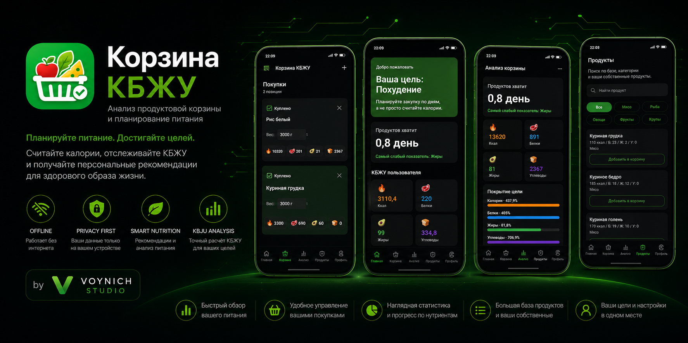
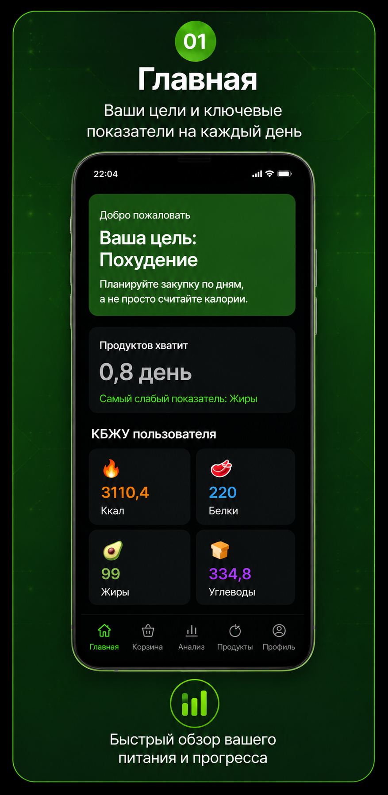
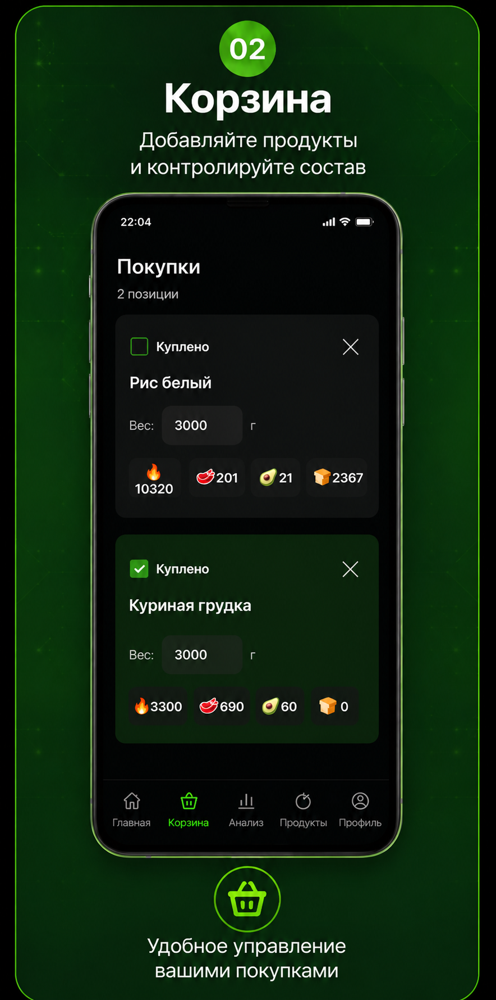
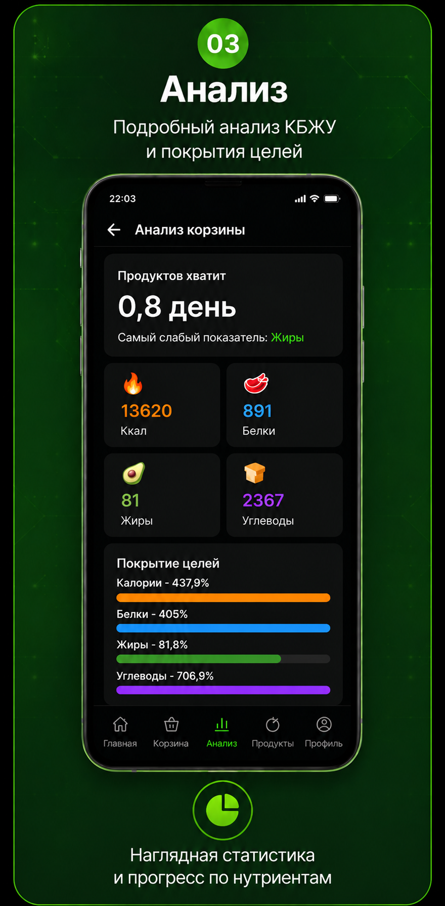
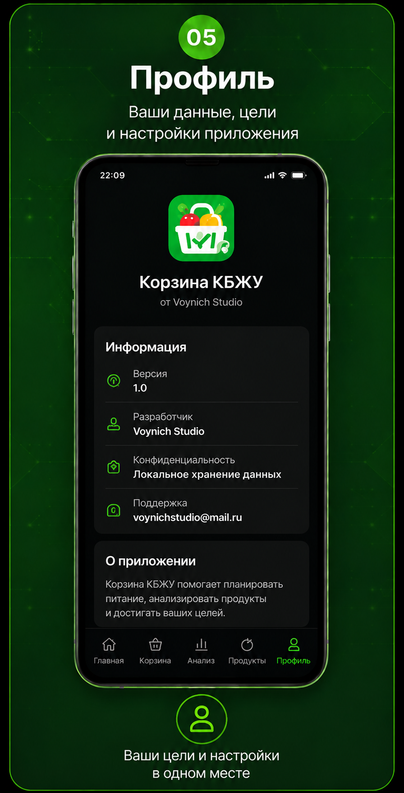

<p align="center">
  
</p>

<h1 align="center">Корзина КБЖУ</h1>

<p align="center">
Современное Android-приложение для анализа продуктовой корзины, расчёта КБЖУ и планирования питания.
</p>

<p align="center">


</p>

---

# О приложении

**Корзина КБЖУ** помогает анализировать продуктовую корзину, рассчитывать калории, белки, жиры и углеводы, контролировать питание и понимать, насколько выбранных продуктов хватит для достижения поставленной цели.

Приложение полностью работает без интернета, не требует регистрации и хранит пользовательские данные исключительно на устройстве.

---

# Основные возможности

✅ Автоматический расчёт КБЖУ

✅ Анализ продуктовой корзины

✅ Оценка покрытия целей питания

✅ Расчёт запаса продуктов в днях

✅ Персональные рекомендации

✅ Встроенная база продуктов

✅ Пользовательские продукты

✅ Работа полностью офлайн

✅ Локальное хранение данных

✅ Без рекламы

---

# Скриншоты

## Главный экран

<p align="center">

</p>

---

## Корзина

<p align="center">

</p>

---

## Анализ

<p align="center">

</p>

---

## Продукты

<p align="center">

</p>

---

## Профиль

<p align="center">

</p>

---

# Демонстрация работы

<p align="center">

</p>

---

# Используемые технологии

- Java
- Android SDK
- Material Design
- XML
- SharedPreferences
- Gradle
- Git
- GitHub

---

# Архитектура

```
UI

↓

Activities

↓

Business Logic

↓

SharedPreferences

↓

Local Storage
```

---

# Roadmap

| Версия | Статус |
|--------|--------|
| 1.0 | ✅ Первый публичный релиз |
| 1.1 | 🔄 Оптимизация интерфейса |
| 2.0 | ⭐ Smart Basket |
| 3.0 | ⭐ Smart Menu |
| 4.0 | ⏳ AI-рекомендации |
| 5.0 | ⏳ Облачная синхронизация |

---

# Скачать

После публикации приложение будет доступно в Google Play.

---

# Разработчик

**Voynich Studio**

🌐 https://voynich-studio.github.io

📧 voynichstudio@mail.ru

---

<p align="center">

<b>Спасибо за интерес к проекту!</b>

Если вам понравилось приложение — поставьте ⭐ репозиторию.

</p>
